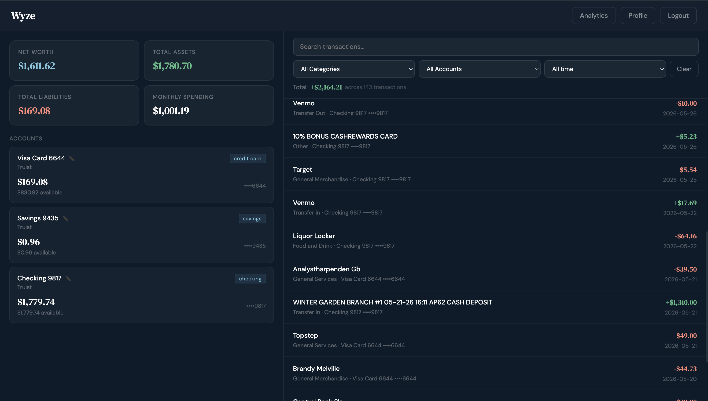
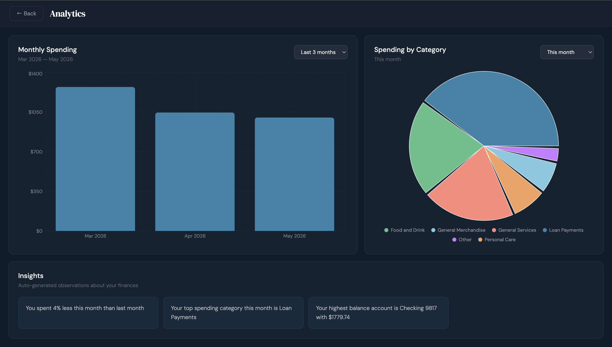
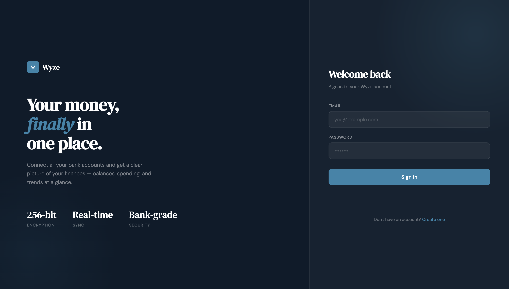
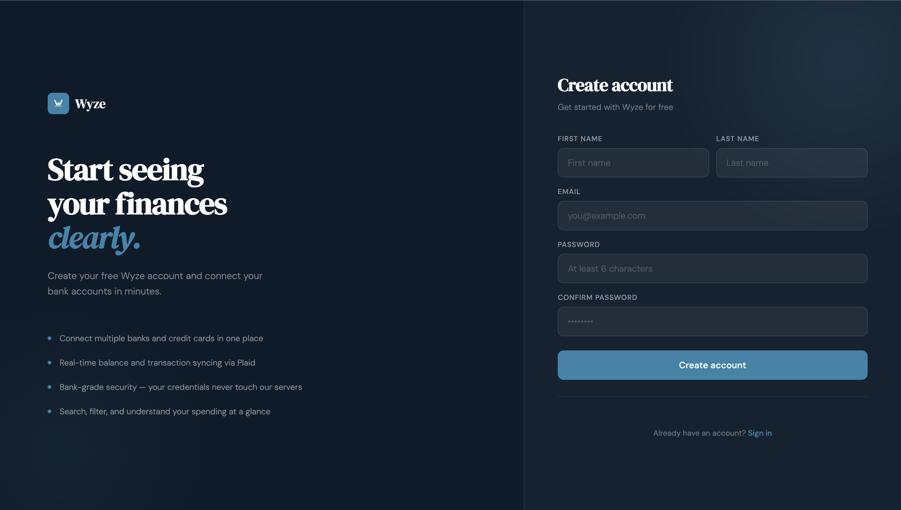
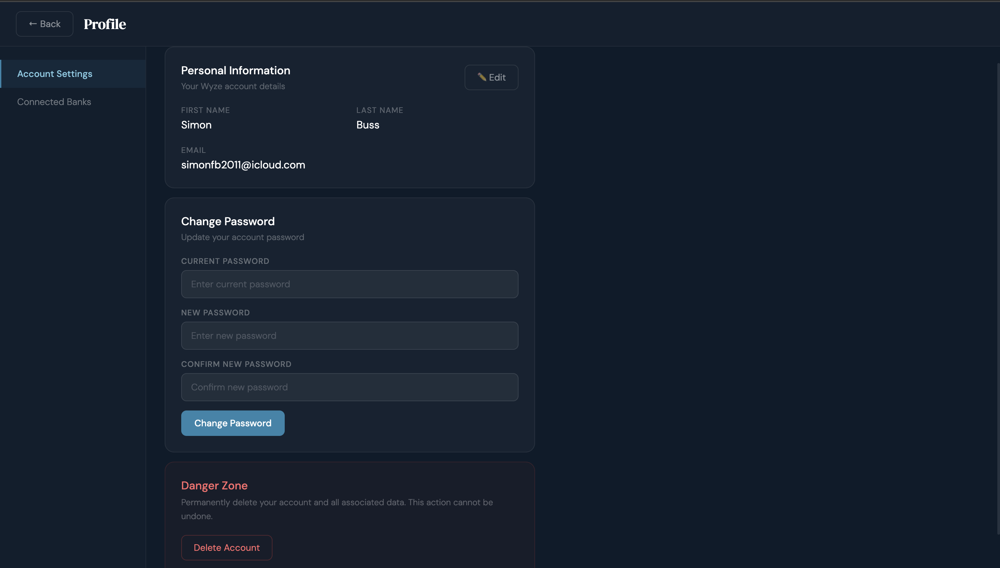
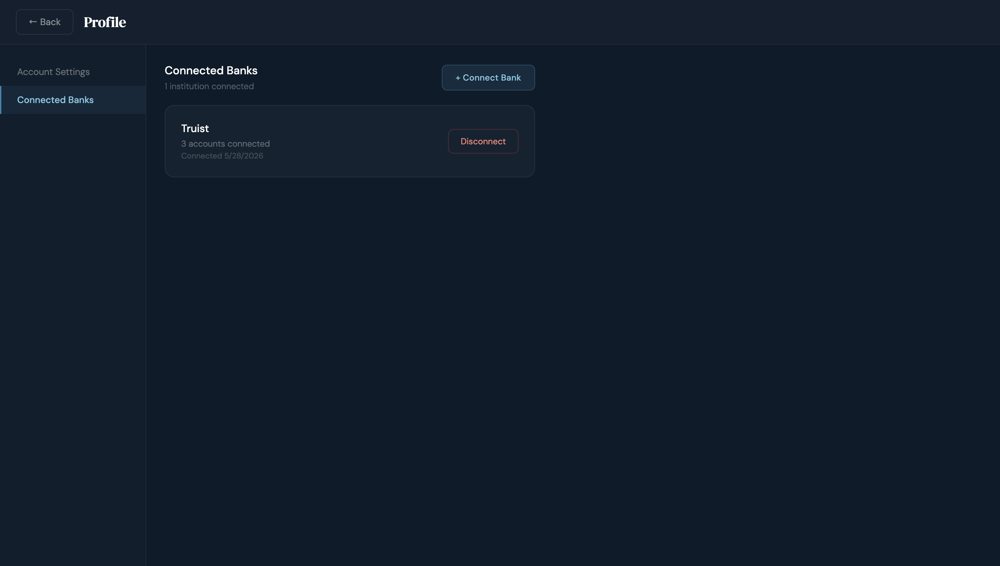
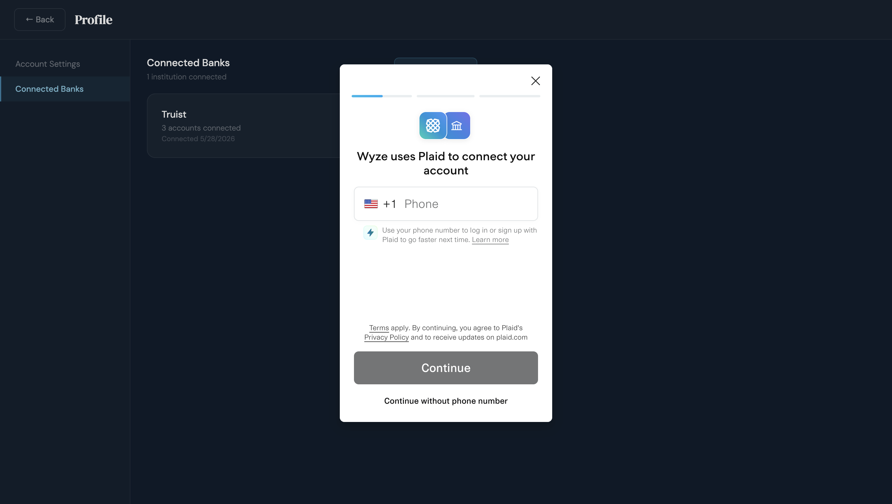
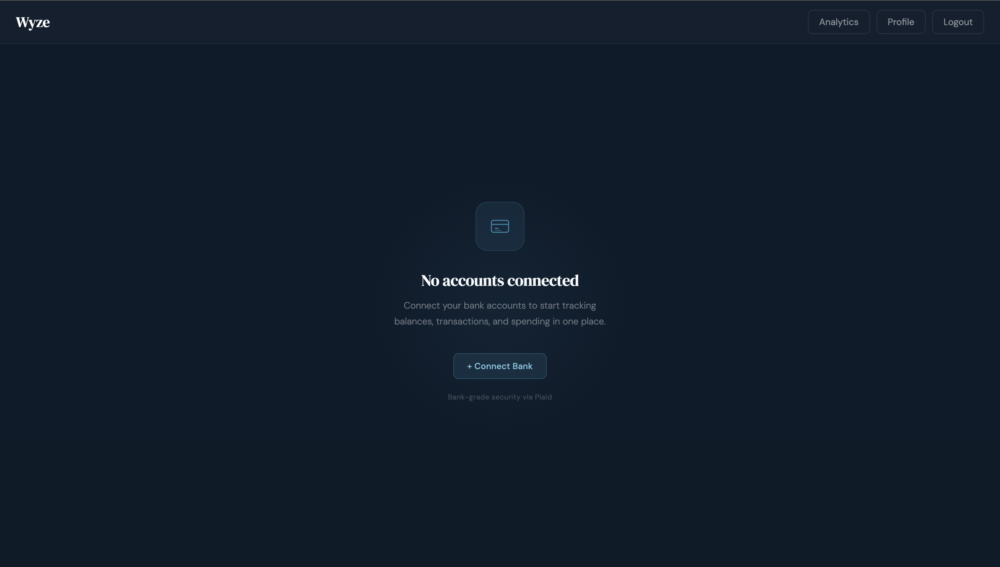

# Wyze — Personal Finance Dashboard (Frontend)

A React frontend for the Wyze personal finance dashboard. Connects to the Wyze Spring Boot API and integrates Plaid Link to let users connect multiple bank accounts and view aggregated balances, transaction history with filtering, and spending analytics — all in one place.

**Live App:** [wyze-personal-finance-application-f.vercel.app](https://wyze-personal-finance-application-f.vercel.app)  
**Backend Repo:** [wyze-personal-finance-application-backend](https://github.com/simonbuss05/wyze-personal-finance-application-backend)

---

## Tech Stack

| Layer | Technology |
|---|---|
| UI Framework | React 18 |
| Routing | React Router v6 |
| HTTP Client | Axios with JWT interceptor |
| Bank Integration | Plaid Link (vanilla JS SDK via `window.Plaid`) |
| Charts | Recharts |
| State | React Context API + useState/useEffect |
| Deployment | Vercel |

---

## Features

**Dashboard**
- Net worth, total assets, total liabilities, and monthly spending summary cards
- Full account list with real-time balances — click any account to filter transactions by it
- Custom account nicknames — rename any account with a persistent display name
- Transaction feed with search, category filter, account filter, and date range filter
- Filter total — shows the sum of all transactions matching current filters across all pages
- Load more pagination

**Analytics**
- Monthly spending bar chart with dynamic range selector (up to 12 months or however much data exists)
- Spending by category pie chart with the same range selector
- Small categories automatically grouped into "Other" to keep the chart readable
- Auto-generated insights panel — biggest transaction, month-over-month change, top category, highest balance account

**Profile**
- Edit name and email
- Change password
- Connected banks tab — view and disconnect institutions
- Danger zone — permanently delete account and all data

**Auth**
- Register and login with JWT authentication
- 7-day token expiration
- Automatic redirect to login on expired or invalid token
- Error boundary — graceful fallback UI on unexpected crashes

---

## Screenshots

### Dashboard


### Analytics


### Login


### Register


### Profile — Account Settings


### Connected Banks


### Plaid Integration


### Onboarding


---

## Project Structure

```
src/
├── components/
│   ├── ConnectBankButton.js   # Plaid Link integration, syncing state
│   ├── EmptyState.js          # No-accounts state with connect prompt
│   ├── ErrorBoundary.js       # App-level crash fallback
│   └── ProtectedRoute.js      # Auth-gated route wrapper
├── context/
│   └── AuthContext.js         # JWT storage, login/logout
├── hooks/
│   └── useDashboard.js        # Fetches summary + accounts on mount
├── pages/
│   ├── Landing.js             # Public landing page at /
│   ├── Login.js               # Login form
│   ├── Register.js            # Registration form
│   ├── Dashboard.js           # Main app view — accounts + transactions
│   ├── Analytics.js           # Charts and insights
│   └── Profile.js             # Account settings and connected banks
├── services/
│   └── api.js                 # Axios instance with JWT + 401 interceptor
└── App.js                     # Routes and provider setup
```

---

## Authentication Flow

```
1. User registers or logs in → backend returns JWT
2. JWT stored in localStorage via AuthContext
3. Axios request interceptor attaches JWT to every outgoing request
4. ProtectedRoute checks for token — redirects to /login if absent
5. Axios response interceptor catches 401 → clears token, redirects to /login
6. Logout clears token from state and localStorage
```

---

## Plaid Integration Flow

```
1. ConnectBankButton mounts → immediately fetches link_token from backend
2. window.Plaid.create() initializes with the link_token
3. Button shows "Loading..." until Plaid SDK is ready, then "+ Connect Bank"
4. User clicks → Plaid Link widget opens
5. User authenticates with their bank inside Plaid's secure hosted widget
6. onSuccess fires with public_token
7. Frontend POSTs public_token to /api/plaid/exchange-token
8. Backend syncs accounts and transactions → redirects to dashboard
```

The vanilla `window.Plaid` SDK is used instead of `react-plaid-link` to avoid a double-initialization bug caused by React's component lifecycle. The Plaid script is loaded once in `public/index.html`.

---

## Key Components

### `ConnectBankButton`
Pre-fetches the Plaid link token on mount so the button is ready immediately when clicked. Uses `window.Plaid.create()` directly rather than the React wrapper. A cancellation flag prevents state updates if the component unmounts before the token fetch resolves.

### `Dashboard`
The main app view split into two columns — accounts on the left, transactions on the right. Account cards are clickable to filter the transaction list by that account. The filter bar includes search, category, account, and date range selects. A filter total line below the filters shows the aggregate sum of all matching transactions across all pages, not just the current page.

### `Analytics`
Fetches 12 months of spending data on load to determine how many months of data exist, then dynamically generates the range selector options to only show ranges that have data. For example if the user only has 3 months of history, the "Last 6 months" and "Last 12 months" options don't appear. Both charts have independent range selectors.

### `Profile`
Two-tab sidebar layout — Account Settings (personal info, password, danger zone) and Connected Banks (list of institutions with disconnect). All destructive actions go through confirmation modals.

### `api.js`
Configured Axios instance with a request interceptor that attaches JWT and a response interceptor that catches 401 errors and automatically clears the token and redirects to login — no manual handling needed anywhere in the app.

### `ErrorBoundary`
Class component wrapping the entire app. Catches any unhandled render errors and shows a clean "Something went wrong — Refresh Page" fallback instead of a white screen.

---

## Running Locally

### Prerequisites
- Node.js 18+
- npm
- Wyze backend running on `http://localhost:8080`

### Setup

**1. Clone the repository**
```bash
git clone https://github.com/simonbuss05/Wyze-personal-finance-application-frontend.git
cd Wyze-personal-finance-application-frontend
```

**2. Install dependencies**
```bash
npm install
```

**3. Start the development server**
```bash
npm start
```

The app runs on `http://localhost:3000` and proxies API calls to the backend at `http://localhost:8080`.

---

## Deployment

Deployed on [Vercel](https://vercel.com). Connected to the GitHub repository — every push to `main` triggers an automatic redeployment.

Environment variable set in Vercel dashboard:
```
REACT_APP_API_URL=https://wyze-personal-finance-application-backend-production.up.railway.app
```

The `api.js` baseURL falls back to `http://localhost:8080` if the environment variable is not set, so local development works without any configuration.

---

## Author

Simon Buss — [github.com/simonbuss05](https://github.com/simonbuss05)